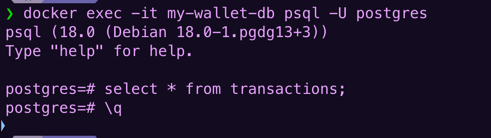
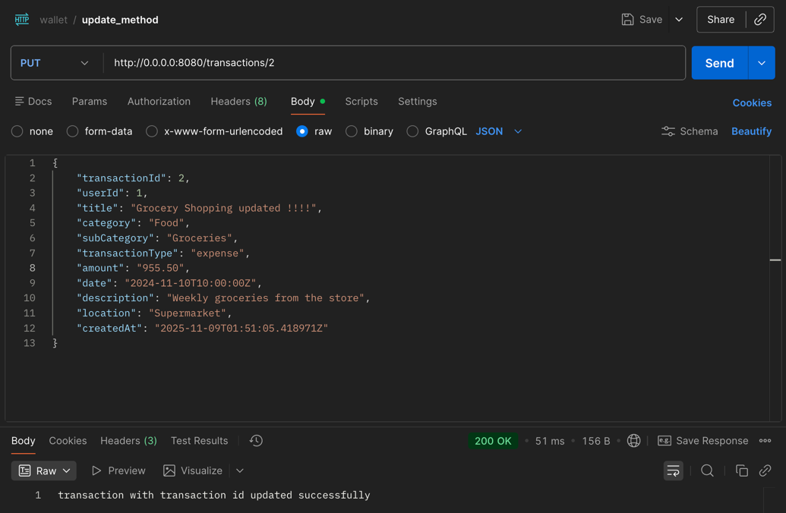
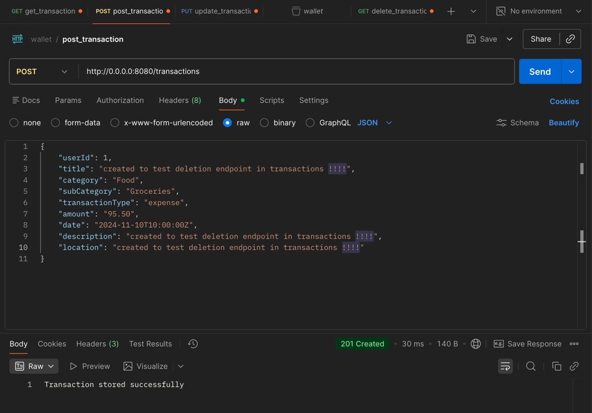
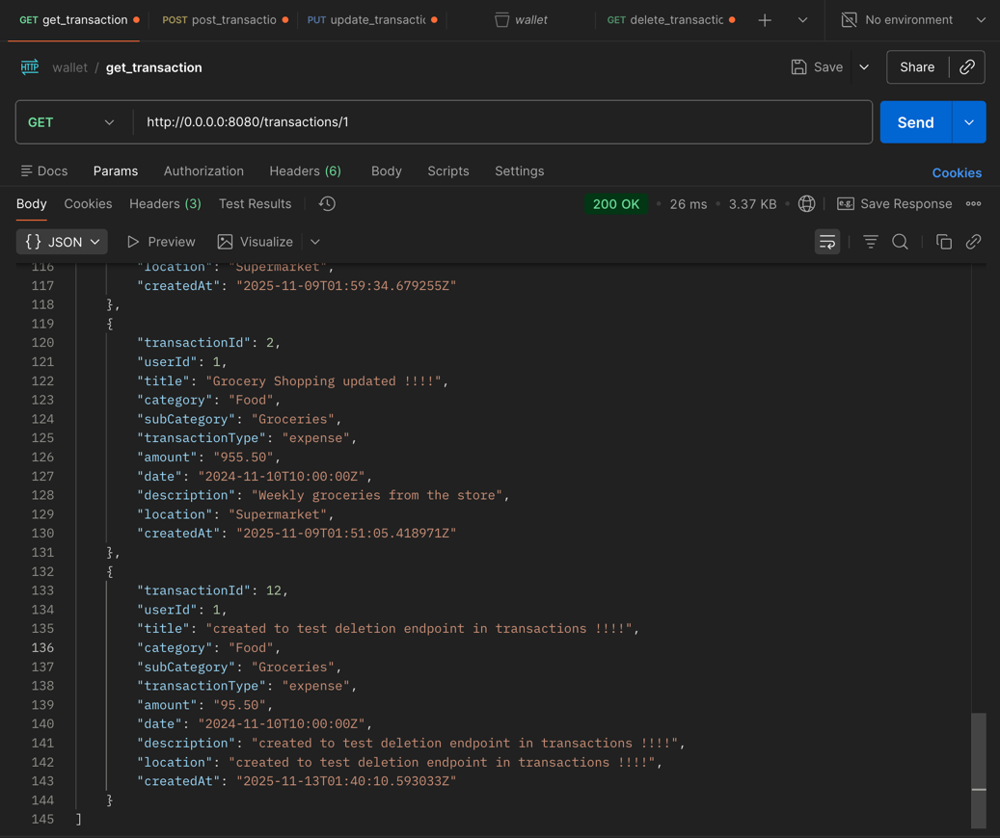
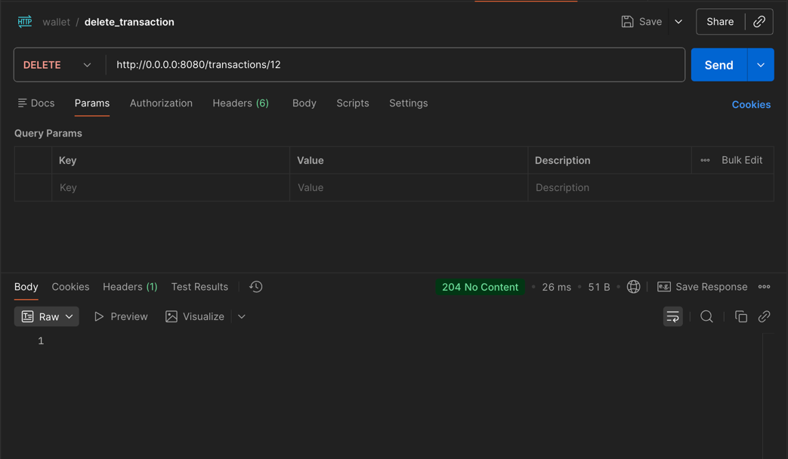

# Local Development Setup 

> start: prajith ravisankar - date: nov 8, 2025 - time: 11:00 AM.

To run this project on your local machine, you will need to have a PostgreSQL database running. We use Docker to ensure a consistent environment for all developers.

### 1. Prerequisites

- Make sure you have [Docker Desktop](https://www.docker.com/products/docker-desktop/) installed and running on your computer.

### 2. Start the Database

Open your terminal and run the following command to start a PostgreSQL container:

- verify that we have required dependencies in the build.gradle.kts
  - `implementation(libs.postgresql)`
- open docker desktop
- using docker to setup postgre sql to run postgre sql from my computer
  - `docker run --name my-wallet-db -e POSTGRES_PASSWORD=mysecretpassword -p 5432:5432 -d postgres`
  - you will see something like this :
    - 
  - now we have created our personal isolated database server that is running in our computer background
  - to verify if our database is running `docker ps
    - 

### 3. Database connection
- refer Databases.kt to understand how we establish connection to postgre sql. 
  - `DriverManager.getConnection(url, user, password)` this line establishes the connection with postgre sql by calling the connection driver. 
- whenever we start our web server(s) we want it to do 2 things: 
  - connect to the database using the Database.connect() function.
  - create our tables for the server to use if the tables don't exist already. 
    - we created custom types for transactions and budgets and used it inside corresponding tables
    - created list of string of sql commands
    - and are executing each of these sql commands in order in a loop with the help of the `connection.use {conn -> }` method
- These are 2 Databases.kt, one in the package com.example, one inside com.example.plugins. 
  - the one in the plugins folder is used by Application.kt to call the initialization function in the Databases.kt in the com.example package. 

### 4. errors faced
- expected errors, the very first time we run the server it is expected for Database.init() function connected to our empty database. 
- our try catch block caught the error and printed it in the console. 
  - 1.Your app tries to create transaction_type. It fails because it exists. Your catch block prints "Error executing...".
  - 2.Your app tries to create period_type. It fails because it exists. Your catch block prints "Error executing...".
  - 3.Your app checks for the users table. It exists, so it does nothing.
  - 4.Your app checks for the transactions table. It exists, so it does nothing.
  - 5.Your app checks for the budgets table. It exists, so it does nothing.
  - 6.The server finishes starting.

Finally, when verifying if the tables are created properly use this step: 

> end: prajith ravisankar - date: nov 8, 2025 - time: 3:10 PM.

---

> start: srijan ravisankar - date: nov 8, 2025 - time: 7:00 PM. 

## creating transaction data model
- creating transaction data model and having it in models package for seperation of concerns. 
- we use @serializable because it helps us utilize kotlinx serialization library with ktor to convert the class to and from JSON. 
  - this will be useful for API end points. 
- we are planning to use string representation for amount and date for now, and convert it to decimal later.
- refer Transactions.kt for the model

> end: srijan ravisankar - date: nov 8, 2025 - time: 7:30 PM. 

---

> start: prajith ravisankar - date: nov 8, 2025 - time: 7:40 PM. 

# API end points for transaction module

## creating a post endpoint
- api endpoint for adding transactions: 
  - checkout TransactionRoutes.kt
  - here Route.transactionRouting() extends teh Ktor's route class with our own function
  - route("/transactions") {...} groups all endpoints that start with /transactions in one place
  - post {...} is our method that handles post requests sent to /transactions
  - call.receive<Transaction>(). Here, ktor, using serialization plugin, takes the incoming json data and automatically builds a Transaction object.
- in the Routing.kt we are calling our transactionRouting function to active that route. 

### testing the endpoint
- testing using postman for this endpoint
  - created a sample user log to test because userId is not null and foreign key: 
    - 
  - ran into 415 unsupported media type
    ```json
    {
        "userId": 1,
        "title": "Grocery Shopping",
        "category": "Food",
        "subCategory": "Groceries",
        "transactionType": "expense",
        "amount": "95.50",
        "date": "2024-11-10T10:00:00Z",
        "description": "Weekly groceries from the store",
        "location": "Supermarket"
    }
    ```
  - we are missing a middleware/plugin in the Serialization.kt, this lets us convert between JSON and Ktor object. 
  ```kotlin
    install(ContentNegotiation) {
        json()
    }
  ```
  - after the above step: postmap gave us this: Transaction received successfully

### improving the endpoint with actual save functionality to the database
- connecting to a database, creating a sql with safe placeholders, preparing and executing the sql statement based on our response data inside transaction variable
- refer Serialization.kt
    ```kotlin
        // get a connection the the database, it is open, the use {..} block will close it
        // after opening the connection below.
        val connection = Database.connect()

        // we are using safe place holders here (?) - prevents SQL injection attack
        // :: handles type conversions automatically kotlin -> sql types (we have custom type)
        val sql = """
            INSERT INTO transactions (user_id, title, category, sub_category, transaction_type, amount, date, description, location)
            VALUES (?, ?, ?, ?, ?::transaction_type, ?, ?::timestamp with time zone, ?, ?)
        """.trimIndent()

        // automatically closes the connection after executing the statements
        // meaning: Open a database connection, prepare this SQL statement safely, and when done,
        // automatically close the connection — even if something goes wrong.
        connection.use { conn ->
            // preparedStatement = compiled SQL statements ready to get values inserted in place
            // of "?" placeholders.
            val statement = conn.prepareStatement(sql)

            // filling the ? placeholders one by one
            statement.setInt(1, transaction.userId)
            statement.setString(2, transaction.title)
            statement.setString(3, transaction.category)
            statement.setString(4, transaction.subCategory)
            statement.setString(5, transaction.transactionType)
            statement.setBigDecimal(6, BigDecimal(transaction.amount))
            statement.setString(7, transaction.date)
            statement.setString(8, transaction.description)
            statement.setString(9, transaction.location)

            // execute the query to insert the data
            statement.executeUpdate()
        }


        call.respond(HttpStatusCode.Created, "Transaction stored successfully")
    ```
  - proof: 

### metrics and benchmark for post endpoint "/transactions"
- response times for 10 "/transactions" post calls: 142ms, 52 ms, 28 ms, 24 ms, 47 ms, 17 ms, 24 ms, 24 ms, 30 ms, 21 ms
- average time: 40 ms


> end: prajith ravisankar - date: nov 8, 2025 - time:  PM. 

---

> start: prajith ravisankar - date: nov 9, 2025 - time: 8:50 AM.


# Read Operation for Transactions module

### basic implementation
- define get all transactions route in TransactionRoutes.kt
  - defined get("{userId}") {...} route in TransactionRoutes.kt
  - converted the userId param value from string url to int or null, and handle the null case. 
  - return@get means return from only the inner get endpoint and not the entire routing function.
  - 

### testing basic implementation
- testing: http://0.0.0.0:8080/transactions/1, it is working returning: "Endpoint is working. will fetch transactions for user ID: 1"
- testing: http://0.0.0.0:8080/transactions/abc, it is returning as expected: "invalid user id"
- terminal output: 
  - Fetching transactions for user ID: 1
  - Fetching transactions for user ID: 3
  - Fetching transactions for user ID: 1

### implementing database connectivity for get endpoint
```kotlin
        // look for get request to "/transaction/someNumber" and name the someNumber to userId
        // Example: /transactions/1 here the userId is 1
        get("{userId}") {
            // ktor captures the value from URL path and its always a string, we need to convert it to int
            val userId = call.parameters["userId"]?.toIntOrNull()

            if (userId == null) {
                call.respond(HttpStatusCode.BadRequest, "invalid user id")
                return@get // this means exit only from current lambda inner function the get {...}
                // not the entire outer function.
            }

            val connection = Database.connect()
            val sql = """
                SELECT transaction_id, user_id, title, category, sub_category, transaction_type, 
                        amount, date, description, location, created_at
                FROM transactions 
                WHERE user_id = ? 
                ORDER BY date DESC
            """.trimIndent()

            val transactions = mutableListOf<Transaction>()
            connection.use { conn ->
                val statement = conn.prepareStatement(sql)
                statement.setInt(1, userId) // replace the first ? placeholder with userId
                val resultSet = statement.executeQuery() // resultSet is like a cursor for a table where we can loop through all the records row by row
                while (resultSet.next()) {
                    // while the cursor is not at the end of the table, get the current transaction (current row)
                    // and create a Transaction object from it and add it to the transactions list and return it.
                    val currentTransaction = Transaction(
                        transactionId = resultSet.getInt("transaction_id"),
                        userId = resultSet.getInt("user_id"),
                        title = resultSet.getString("title"),
                        category = resultSet.getString("category"),
                        subCategory = resultSet.getString("sub_category"),
                        transactionType = resultSet.getString("transaction_type"),
                        amount = resultSet.getBigDecimal("amount")?.toPlainString() ?: "0",
                        date = resultSet.getTimestamp("date")?.toInstant()?.toString()?: resultSet.getString("date") ?: "",
                        description = resultSet.getString("description"),
                        location = resultSet.getString("location"),
                        createdAt = resultSet.getTimestamp("created_at")?.toInstant()?.toString() ?: ""
                    )

                    // resultSet.getTimestamp("date")?.toInstant()?.toString()?: resultSet.getString("date") ?: "",
                    // resultSet.getTimestamp("date")?.toInstant() -> call toInstant only if resultSet.getTimestamp("date") not null
                    // resultSet.getTimestamp("date")?.toInstant()?.toString() -> call toString only if resultSet.getTimestamp("date")?.toInstant() not null
                    // resultSet.getTimestamp("date")?.toInstant()?.toString() ?: resultSet.getString("date") -> if this (resultSet.getTimestamp("date")?.toInstant()?.toString()) is null, use this (resultSet.getString("date"))
                    // resultSet.getTimestamp("date")?.toInstant()?.toString()?: resultSet.getString("date") ?: "" -> if this is null (resultSet.getTimestamp("date")?.toInstant()?.toString()?: resultSet.getString("date")) use this ("")

                    transactions.add(currentTransaction)
                }
            }

            call.respond(HttpStatusCode.OK, transactions)
        }
```
    - testing result: calling get method for http://0.0.0.0:8080/transactions/1, results: 

> end: prajith ravisankar - date: nov 9, 2025 - time: 10:35 PM. 

---

> start: prajith ravisankar - date: nov 10, 2025 - time: 8:40 AM.

# Update and delete Operation for Transactions module

## notes
- following the same endpoint declarations as create and read from above. Please refer TransactionRoute.kt for update and delete endpoints in the route. 
- transaction_type = ?::transaction_type means: Take the parameter value (?) and cast it to the custom PostgreSQL enum type transaction_type (which only allows 'expense' or 'income')
- in the delete endpoint call.respond(HttpStatusCode.NoContent) implies 204 no content means successful delete with no body
- opening interactive sql window inside docker container: 
```terminaloutput
docker exec -it my-wallet-db psql -U postgres
```
- docker exec
  - Runs a command inside an already running container.
- -i
  - Keeps STDIN (input) open, so you can send commands into it (interactive input).
- my-wallet-db
  - This is the name (or ID) of your running PostgreSQL container.
- psql -U postgres
  - Runs the psql (PostgreSQL CLI client) inside that container:
- -U postgres → connect as user postgres the default username setup by the docker as we havent' mentioned any user name
- So basically, you’re saying: “Run the PostgreSQL shell (psql) inside the running container named my-wallet-db, connecting as user postgres”


## testing
- put method: 
- delete method: creating the example using post: , here it is showing in the get results: , and then deleting it: 

## metrics and benchmark
<TODO: add metrics and benchmark for update and delete endpoints after the MVP cycle>

> end: prajith ravisankar - date: nov 12, 2025 - time: 9:20 PM.

---

